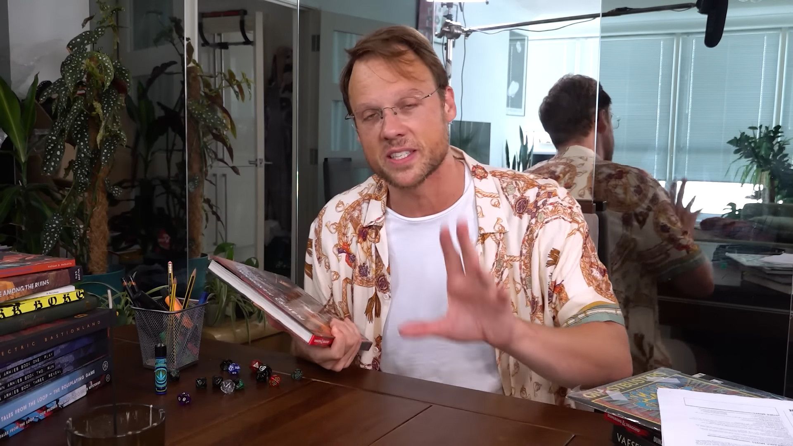
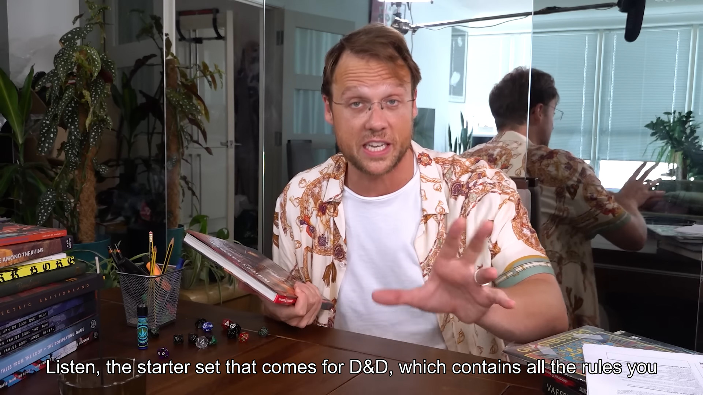
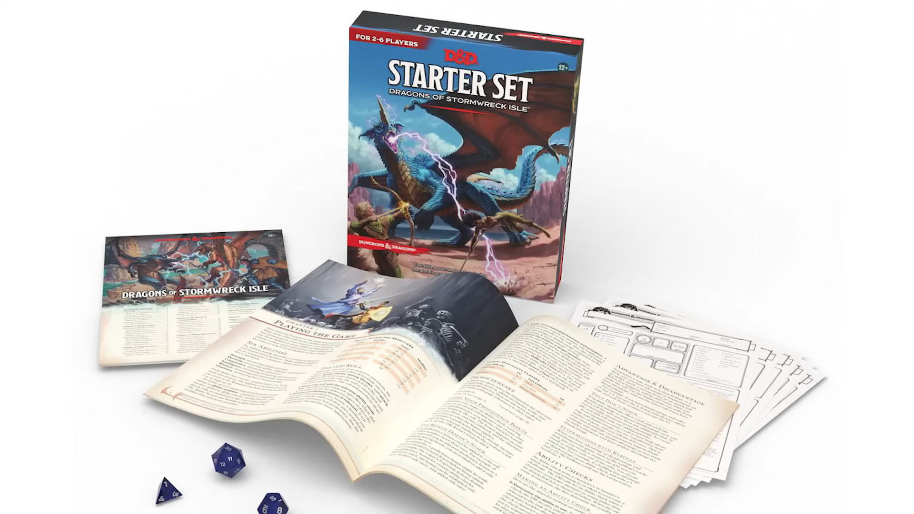
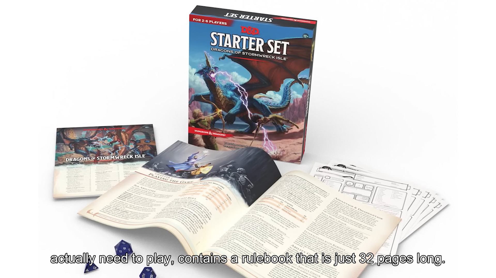
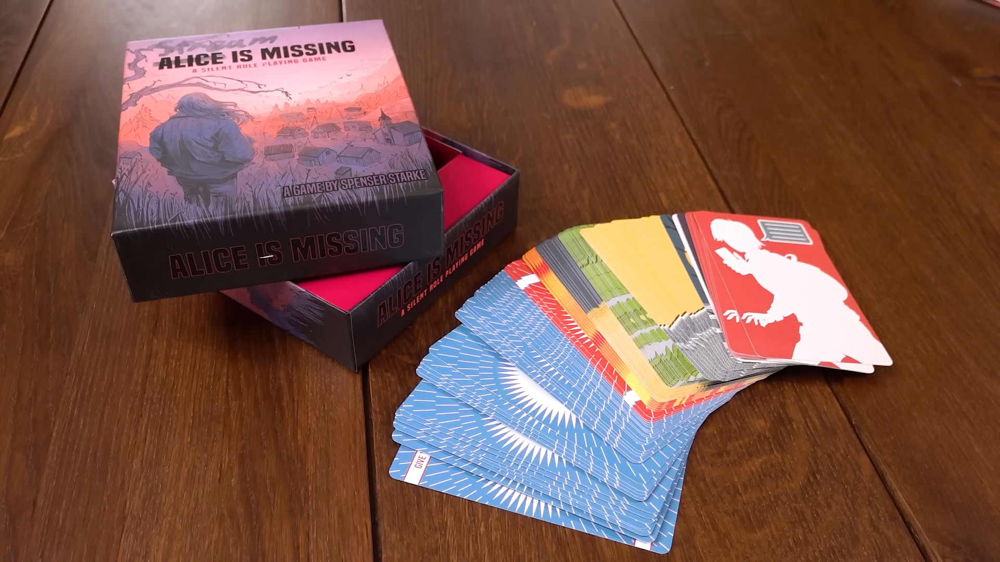
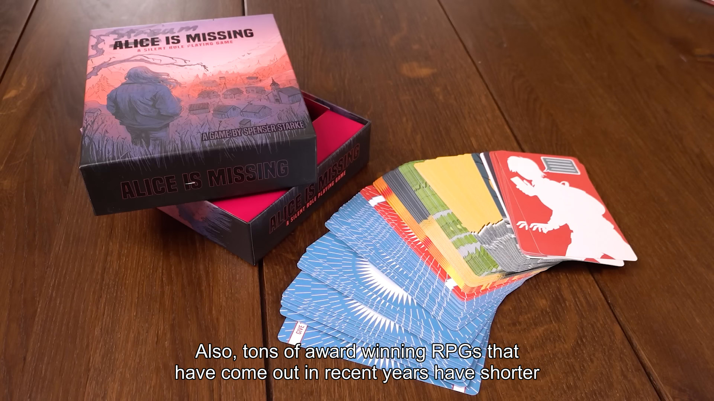

# Tools for subtitles

A few tools that do things that I needed doing on subtitles. The star of the show is OpenAI's whisper model,
used to generate a subtitle that not only is correct, but adheres to the constraints that make up a good subtitle
(characters per second limit, minimal distance between cues else they are concatenated...)

## Preview

`uv run .\auto-sub\auto-sub.py susd_dnd.acc base.en`

| Before                                | After                                 |
| ------------------------------------- | ------------------------------------- |
|  |  |
|  |  |
|  |  |